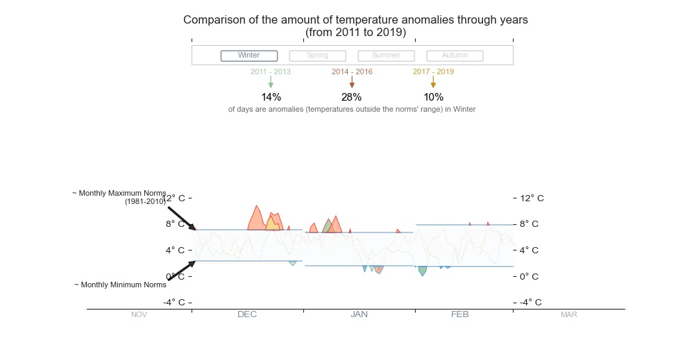

# Is global warming increasing  the amount of temperature anomalies? 
---

In this notebook, I am going to highlight temperature anomalies for the ILE-DE-FRANCE region (France) through an interactive chart. Data comes from [METEO FRANCE](https://donneespubliques.meteofrance.fr/) and I am going to consider daily average temperatures from 2011 to 2019.

The interactive feature of this chart will allow the user to **compare anomalies between all years (from 2011 to 2019) per season** (Winter, Spring, Summer and Autumn). 

#### Seasonal ranges of dates considered:

- Winter : 1st December (of previous year) to  28th February.
- Spring : 1st March to 31st May.
- Summer : 1st June to 31st August.
- Autumn : 1st September to 30th November.

The fact that the Winter season contains a month outside its considered year (December for instance), obliges us to have a dataset of temperatures (2011-2019) **from 01st December 2010 to 30th November 2019** in order to have all the seasons for each of the nine years.

Futhermore, in order to make visualization efficient, I will stack each set of consecutive 3 years together (2011-2013, 2014-2016, 2017-2019), and get the average temperature per day of each trio.

The interactive chart will look like this : 

 
    
<h4 style="text-align: center;" markdown="1">  &nbsp;&nbsp;&nbsp;&nbsp;&nbsp;&nbsp;&nbsp;&nbsp;Interactive chart showing temperature anomalies per season from 2011 to 2019.</h4>

As displayed in this graph, anomalies are daily temperatures above and below monthly maximum and minimum norms respectively.
The user can click on another season to get the comparison on it.

#### Datasets : from [METEO FRANCE](https://donneespubliques.meteofrance.fr/)

-  108 monthly datasets of temperature observations every 3 hours in France for all its regions under 
`synop.[year][month].csv`
-  `postesSynop.txt` which maps the ID of the measuring stations with the region they are in. A region can have many spots where the temperature is measured.
